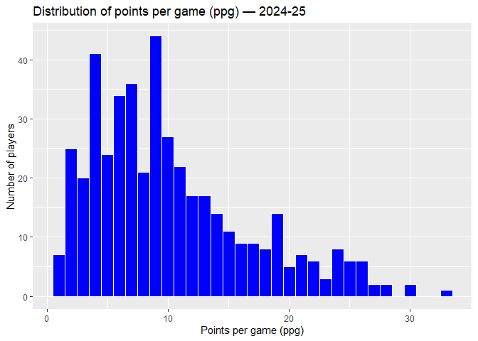
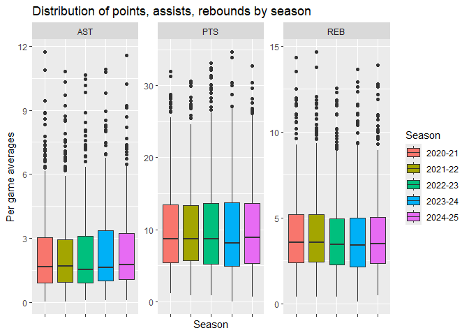

# Analysis on NBA players statistical performance

#### Dominic DiRe, Blake Lewis, Will Stone

## Introduction

This project explores NBA player and team statistics pulled from the NBA
API across 5 seasons (2020-21 season through 2024-25 season). Basketball
is a sport with a great tie to statistics, and modern data collection
allows us to track how individual players and the league as a whole
evolve over time, although it’s just 5 seasons. Analysis on this topic
can reveal trends in player development, positional changes in the
modern NBA, and how elite players separate themselves from the rest of
the league. The goal is to visualize league-wide stat distributions and
track individual player development over time, with a focus on Luka
Doncic, the future face of the NBA. Who we believe might be able to be a
good basis to separate the stars from the future hall of famers.

In pursuit of the goal stated above, we will explore the following
questions:

1.  What does the distribution of key stats (points, rebounds, assists)
    look like across the league, and how have those distributions
    shifted across seasons?

2.  Which players are the most efficient scorers? How does scoring
    volume relate to shooting efficiency?

3.  Who are the top 10 scorers, rebounders, and assisters each season,
    and how much turnover is there in those lists year over year?

4.  How has the league’s reliance on the three-point shot changed across
    the 5 seasons?

5.  Is there a relationship between minutes played and points per game?

6.  Which players have the best plus/minus relative to their scoring
    load — who is impacting winning beyond just putting up points?

7.  Which non-Luka players showed the most improvement in scoring from
    2020-21 to 2024-25? Who regressed the most?

8.  How has Luka Doncic developed from season to season across points,
    assists, rebounds, and shooting percentages?

9.  How do Luka’s per-game stats compare to league averages each season?

These are the main questions we are looking to answer through the
completion of this project. With the findings we will be able to draw
meaningful conclusions on player development and league-wide trends in
the NBA.

## Data

### Structure

Data was pulled from the NBA Stats API (`stats.nba.com`) using the
`nba_api` Python package. The python file was basic but too long and
embarrassing to add, if divine intervention strikes we can add it.
Player game logs were collected for every regular season game across 5
seasons and aggregated into per-game averages. This produced one CSV per
season for league-wide stats.Also there is another separate combined CSV
for Luka Doncic spanning all 5 seasons.

**League CSVs** (`league_stats_YYYY-YY.csv`) — one row per player,
containing per-game averages for all NBA players in that regular season.

**Luka CSV** (`luka_career_stats.csv`) — one row per season, pulled from
the PlayerCareerStats endpoint.

**Columns included:** `PLAYER_ID`, `PLAYER_NAME`, `TEAM_ABBREVIATION`,
`GP`, `MIN`, `PTS`, `REB`, `AST`, `STL`, `BLK`, `FG_PCT`, `FG3_PCT`,
`FT_PCT`, `TOV`, `PLUS_MINUS`

### Loading

``` r
library(tidyverse)

league_2021 <- read_csv("league_stats_2020-21.csv")
league_2022 <- read_csv("league_stats_2021-22.csv")
league_2023 <- read_csv("league_stats_2022-23.csv")
league_2024 <- read_csv("league_stats_2023-24.csv")
league_2025 <- read_csv("league_stats_2024-25.csv")

luka <- read_csv("luka_career_stats.csv")
```

### Merging

Since each league CSV covers a single season but contains no season
identifier, so we added a `SEASON` column to each dataframe before
combining them. Without the column there wouldn’t be a way to tell where
data came from

``` r
league_2021$SEASON <- "2020-21"
league_2022$SEASON <- "2021-22"
league_2023$SEASON <- "2022-23"
league_2024$SEASON <- "2023-24"
league_2025$SEASON <- "2024-25"
```

With the season identifier in place, we combined all 5 dataframes into a
single `df1` (later is `master`) dataframe using `bind_rows`.
`left_join` merges datasets horizontally but for this dataset that
doesn’t make as much sense. So we used `bind_rows`, which stacks
datasets vertically. This is appropriate here because all 5 league CSVs
share identical columns — they are the same data structure repeated
across different seasons. Which makes this process quite easy.

``` r
df1 <- bind_rows(league_2021, league_2022, league_2023, league_2024, league_2025)
```

The raw data includes all players who appeared in at least one regular
season game, including players who played only a handful of minutes
across a few games. We filtered to players with at least 20 games played
to ensure per-game averages are based on a meaningful sample size. Also
if we didn’t add this we had a player who scored 30 points in a single
game appearance would show a 30.0 PPG average and distort league-wide
distributions. Also running this line puts the number of observations
from 3261 to 2316, so the change it quite noticeable.

``` r
df1 <- df1 %>% filter(GP >= 20)
```

To ease running the code, we saved the merged and slightly cleaned
dataset to “master.csv” so you only have to run this line. I know we
aren’t at all going for efficiency this project but I still feel like
it’s nice to have.

``` r
write.csv(df1, "master.csv", row.names = FALSE)
```

### Variables

- PLAYER_ID: Unique numeric identifier for each player assigned by the
  NBA.
- PLAYER_NAME: First Last style full name of player.
- TEAM_ABBREVIATION: The 3-letter abbreviation of the team the player
  played for (e.g. DAL, LAL).
- SEASON: The NBA season the stats were recorded in, in YYYY-YY format
  (e.g. 2023-24).
- GP: Games Played, the number of regular season games not including any
  play-ins or playoffs.
- MIN: Minutes Per Game, the average minutes for that player per game.
- PTS: Points Per Game, the average points for that player per game.
- REB: Rebounds Per Game, the average number of total rebounds
  (offensive and defensive grouped) per game.
- AST: Assists Per Game, the average assists for that player per game.
- STL: Steals Per Game, the average steals for that player per game.
- BLK: Blocks Per Game, the average blocks for that player per game.
- FG_PCT: Field Goal Percentage, the share of all field goal attempts
  that were made by player, expressed as a decimal between 0 and 1.
- FG3_PCT: Three-Point Percentage, the share of three-point attempts
  that were made by player, expressed as a decimal between 0 and 1.
- FT_PCT: Free Throw Percentage, the share of free throw attempts that
  were made by player, expressed as a decimal between 0 and 1.
- TOV: Turnovers Per Game, the average turnovers for that player per
  game.
- PLUS_MINUS: The average point differential for the player’s team while
  they were on the court.

### Cleaning

First, read the master.

``` r
library(readr)
library(tidyverse)
master <- read_csv('master.csv')
```

Problem with the dataset as is, is that the traded players or players
who get picked up by multiple team in a season, the player has 2 team
rows. This caused a problem a bit later using `pivot_wider`, where it
didn’t know what to pick essentially. Now this function is to sort out
players with multiple team rows in the same season.

``` r
master <- master %>%
  group_by(PLAYER_ID, PLAYER_NAME, SEASON) %>%
  summarise(
    GP = sum(GP),
    MIN = mean(MIN),
    PTS = mean(PTS),
    REB = mean(REB),
    AST = mean(AST),
    STL = mean(STL),
    BLK = mean(BLK),
    FG_PCT = mean(FG_PCT, na.rm = TRUE),
    FG3_PCT = mean(FG3_PCT, na.rm = TRUE),
    FT_PCT = mean(FT_PCT, na.rm = TRUE),
    TOV = mean(TOV),
    PLUS_MINUS = mean(PLUS_MINUS),
    .groups = "drop"
  )
```

The `master` dataframe is in “long format”, where each player has one
row per season. This structure is wpuld be good for league-wide
distributions and filtering by season. However, for comparing the same
player’s stats side by side across multiple seasons, we also opted for
creating a “wide format” dataframe using `pivot_wider`. In
`master_wide`, each player occupies a single row and each stat gets its
own column per season, such as `PTS_2020-21` and `PTS_2021-22`. Players
who did not appear in a given season will have `NA` for that season’s
columns, newer rookies and retirees.

``` r
master_wide <- master %>%
  select(PLAYER_ID, PLAYER_NAME, SEASON, PTS, REB, AST, STL, BLK,
         FG_PCT, FG3_PCT, FT_PCT, TOV, PLUS_MINUS) %>%
  pivot_wider(
    names_from  = SEASON,
    values_from = c(PTS, REB, AST, STL, BLK, FG_PCT, FG3_PCT, FT_PCT, TOV, PLUS_MINUS),
    names_glue  = "{.value}_{SEASON}"
  )
```

From `master_wide` we got a `PTS_growth` column by subtracting a
player’s 2020-21 scoring average from their 2024-25 average, this is
work in progress so far but the idea is there. This gives us a simple
stat to identify which players improved the most in scoring over the
full 5 year span. Players with `NA` in either season, meaning they did
not meet the games played threshold in one of those years, will have
`NA` for `PTS_growth` as well.

``` r
master_wide <- master_wide %>%
  mutate(PTS_growth = `PTS_2024-25` - `PTS_2020-21`)
```

## Analysis

### What does the distribution of key stats look like across the league?

To kick off the exploration and analysis, the scoring distribution is
probably what people would first think of showing. The scoring
distribution of the most recent season will set a good sort-of baseline
for the shape of the league in scoring. The distribution is
right-skewed. Meaning the majority of players are role players and not
stars, not surprising but notable. Then you can see the high volume
scorers on the right

``` r
master %>%
  filter(SEASON == "2024-25") %>%
  ggplot(aes(x = PTS)) +
  geom_histogram(binwidth = 1, fill = "blue", color = "white") +
  labs(title = "Distribution of points per game (ppg) — 2024-25",
       x = "Points per game (ppg)", y = "Number of players")
```

<!-- -->

Now that a baseline is set for ppg, we are going to look at the 3 key
stats over all 5 seasons. The 3 stats being points, assists, and
rebounds. We use `facet_wrap` to compare the shapes of the points,
rebounds, and assists distributions side by side. So you can see how
production of the key stats is changed between the seasons.

Originally we tried to use a histogram, but wow was that a little hard
to read. It looked nice and we wanted to keep consistency from the
histogram from above, but we decided a boxplot is going to look much
prettier. And I think we were right, any sane data science or stats
major should be foaming at the mouth looking at these.

``` r
master %>%
  select(PLAYER_NAME, SEASON, PTS, REB, AST) %>%
  pivot_longer(cols = c(PTS, REB, AST), names_to = "stat", values_to = "value") %>% # tech
  ggplot(aes(x = SEASON, y = value, fill = SEASON)) +
  geom_boxplot() +
  facet_wrap(~ stat, scales = "free_y") + # TECH, also so each avg diff y
  labs(title = "Distribution of points, assists, rebounds by season",
       x = "Season", y = "Per game averages", fill = "Season") +
  theme(axis.text.x = element_blank()) # was overcrowding, would be fine if no facet_wrap
```

<!-- -->

### Which players are the most efficient scorers?

``` r
# placeholder
```

### Who are the top 10 scorers, rebounders, and assisters each season?

``` r
# placeholder
```

### How has the league’s reliance on the three-point shot changed?

``` r
# placeholder
```

### Is there a relationship between minutes played and points per game?

``` r
# placeholder
```

### Which players have the best plus/minus relative to their scoring load?

``` r
# placeholder
```

### Which players improved or regressed the most in scoring?

``` r
# placeholder
```

### How has Luka Doncic developed season to season?

``` r
# placeholder
```

### How do Luka’s stats compare to league averages each season?

``` r
# placeholder
```

## Conclusion
